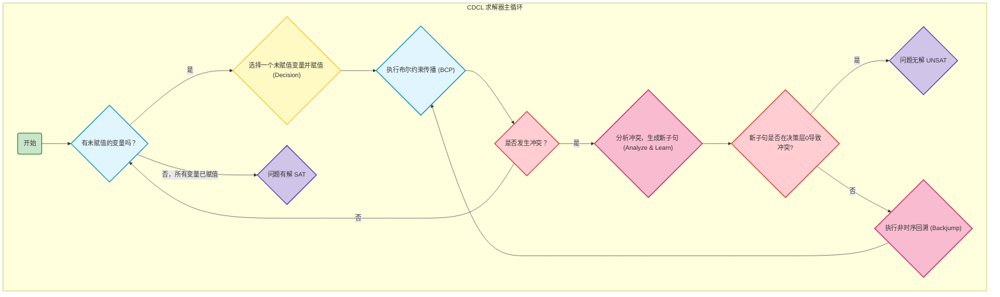

# HyQSAT: A Hybrid Approach for 3-SAT Problems by Integrating Quantum Annealer with CDCL

## 摘要部分

背景：

- 约束满足问题（SAT）是一种重要的不确定性 NPC 问题，在人工智能、图染色、电路分析等工作场景下有重要的应用。
- 量子退火算法（Quantum Annealing, QA）是一种有前景算法，有望解决复杂的 SAT 问题，但目前有编码时间过长的问题，导致硬件实现不高效且规模扩展性弱

工作：提出了一种名为 HyQSAT 的量子-经典混合策略，将量子退火算法与经典的冲突驱动子句学习算法（Conflict-Driven Clause Learning, CDCL）结合起来，实现端到端的加速。

创新点：

- 量化分析子句的冲突频率，应用广度优先遍历的方法，确定将子句嵌入量子设备的顺序，而非将所有的子句都嵌入量子设备
- 将硬件的拓扑结构纳入考虑，从而最大化物理量子比特的利用率
- 调整嵌入系数以提高在量子噪声影响下的计算准确率
- 如何解释基于 QA 能量分布的满足概率，以及如何通过这些信息来指导 CDCL

效果：

- 可行性：可以高效地计算大规模的 SAT 问题（超出现有 QA 可接受的规模）
- 高效性：相对于经典的 CDCL 算法，取得了 12.62 倍的端到端加速，且显著减少了嵌入所需的时间

现有的解决 SAT 问题的算法：

- 经典：CDCL 算法，热点在预热阶段（随机搜索状态空间以指导之后的搜索）
    - 迭代前后依赖，因而使用 GPU 或 FPGA 进行并行的效果不佳
- 量子：QA 算法，热点在嵌入阶段
    - 优点：在理论上相对现有的经典最佳算法具有指数级加速效果，并且量子退火硬件的量子比特规模比量子门电路更容易做大，因而可以解决的问题规模更大
    - 缺点：嵌入时间过长，导致实际实现较为低效，并且不易扩大规模；量子设备中的噪声使得我们需要通过多次采样的方式获得正确的结果，这带来了额外的时间开销，并且在规模较大时，得到正确结果的概率通常接近 0

HyQSAT 的想法：

- CDCL 的预热时间取决于子句的冲突频率，QA 的嵌入时间取决于子句的个数
- HyQSAT 尝试识别 CDCL 难以解决而 QA 易于解决的子句集合，将这部分的子句发送到 QA 设备，并译解 QA 计算的结果以加速 CDCL 搜索

HyQSAT 包括前端和后端

- 前端：找到难解的子句，将其嵌入到 QA 设备中。具体地，根据子句的冲突频率，生成一个子句的队列，并按照顺序将其嵌入 QA 设备，直到其被充分利用
    - 嵌入时间与子句数量呈线性关系
    - 考虑物理比特的拓扑结构，以减少嵌入时的 routing time
    - 调整 QA 目标函数的系数，以减弱噪声的影响
- 后端：读取 QA 的输出结果，使用结果指导 CDCL 的搜索
    - 通过 Gaussian Naive Bayes 模型，将子句按照满足概率分为四类，然后应用这些满足概率对 CDCL 的搜索空间进行剪枝，以减少 CDCL 的迭代次数

## 背景

### 3-SAT 问题

### CDCL

### QA

效果：将时间复杂度从经典的 $O(e^L)$ 优化到 $O(e^{\sqrt{L}})$

将判断 3-SAT 问题的可满足性转化为求解最小化问题

$$
    \arg\min H_C (X) = I + \sum_{i=1}^L B_i x_i + \sum_{i=1}^L \sum_{j=i+1}^L J_{i,j} x_i x_j.
$$

如果能找到布尔向量 $X = (x_1, x_2, \ldots, x_L)$ 使得 $H_C(X) = 0$，则原 3-SAT 问题有解，且 $X$ 为其中的一个解。如果 $\forall X, \enspace H_C(X) > 0$，则原 3-SAT 问题无解。

如何将 3-SAT 问题转化为最小化问题：

- 对于任意一个子句 $c_k$，我们可以将其分解为两个 sub-clause

    $$
    \begin{aligned}
        c_{k,1} &= a_k \leftrightarrow  (l_1 \vee l_2) \\
        c_{k,2} &= l_3 \vee a_k
    \end{aligned}
    $$

- 两个 sub-clause 的求解可以转化为最小化

    $$
    \begin{aligned}
        H_{c_{k,1}}(a_k, x_1, x_2) &= a_k + H_{l_1}(x_1) + H_{l_2}(x_2) - 2a_k H_{l_1}(x_1) - 2a_k H_{l_2}(x_2) + H_{l_1}(x_1) + H_{l_2}(x_2) \\
        H_{c_{k,2}}(a_k, x_3) &= 1 - a_k - H_{l_3}(x_3) + a_k H_{l_3}(x_3)
    \end{aligned}
    $$

    其中 $H_{l_i}(x_i) = \begin{cases} x_i, & l_i = x_i \\ 1 - x_i, & l_i = \lnot x_i \end{cases}$.
    
- 将所有 sub-clause 的目标函数加和便得到了总的目标函数

    $$
        H_C(X, A) = \sum_{k=1}^m (\alpha_{k,1} H_{c_{k,1}}(X, A) + \alpha_{k, 2} H_{c_{k,2}}(X, A)).
    $$

    其中 $A$ 是所有引入的辅助变量构成的向量

如何通过 QA 硬件解决二次型的最小化问题：

1. 将二次型转化为问题图（problem graph）

    每个节点代表一个布尔变量，两个节点 $i$ 和 $j$ 之间存在边代表二次型中存在 $x_i x_j$ 这一项。$B_i$ 和 $J_{i,j}$ 分别对应了节点和边上的权重。

2. 嵌入：为问题图中的每一个节点建立到物理量子比特的映射

    量子比特链（qubit chain）指那些连接在一起，代表了同一个变量的量子比特

## HyQSAT

假设经典的 CDCL 算法需要 K 次迭代以解决 3-SAT 问题，我们设前 $\sqrt{K}$ 次迭代为预热阶段，在此阶段中我们使用 QA 以指导 CDCL 搜索，而剩下的迭代中我们使用经典的 CDCL 算法。由于难解的子句使用 QA 得以解决，剩下的迭代中搜索空间将显著缩小。

## Frontend

1. 生成难解子句队列
2. 将队列中较难的子句嵌入硬件
3. 噪声优化

我们希望选择满足以下特性的子句加入队列：

- 通过经典的 CDCL 算法难以解决，而通过 QA 算法较易解决的子句
- 在嵌入硬件时，这些子句与当前硬件的拓扑结构有较强的兼容性

在将子句嵌入硬件时，我们希望通过设置变量到量子比特的映射，以保证用于表示同一变量的量子比特链的长度较短，从而提高量子比特的利用率

### 子句队列生成

根据在 100 个 3-SAT 问题（包含 860 个子句，200 个变量）上的测试，统计各个子句在传播和冲突解决阶段的被访问次数，我们可以得到：

1. 子句在传播阶段的被访问次数总体上与子句在冲突解决阶段的被访问次数呈正相关关系
2. 被访问次数处于前 1/5 的子句，其在 42% 的迭代中被访问

我们知道 CDCL 的搜索时间总体上由子句被访问的次数决定，如果我们可以将这些被频繁访问的子句通过 QA 来解决，那么子句的被访问次数将会显著降低

首先我们需要找到一种定量估计子句被访问频率的方法：我们为每个子句维护一个活跃度（activity score）参数，满足：

- 初始化为 1
- 解决冲突时，在回溯路径上的子句的活跃度会增加一个常数

下面我们根据活跃度来构建队列：

- 从活跃度前 30 的子句中随机选一个子句作为队列头（随机是为了避免在活跃度没有更新的情况下，重复选择某一个子句作为队列头）
- 定义两个子句邻接，如果两个子句拥有至少一个共同的变量。从作为队列头的子句出发进行广度优先搜索，将所有被访问的子句加入队列，直到遍历结束或是子句数量达到阈值

选择具有共同变量的子句加入队列，是为了在嵌入硬件时可以重复利用代表共同变量的量子比特

### 硬件嵌入

D-Wave 2000Q 上的量子比特 8 个为一组，其中 4 个为水平比特，4 个为垂直比特。水平比特与 4 个垂直比特之间均存在连接，垂直比特与 4 个水平比特之间均存在连接。处于水平相邻的组的同一行上的两个水平比特相互连接，处于垂直相邻组的同一列上的两个垂直比特相互连接。

嵌入算法：

1. 根据子句队列中的顺序将变量逐一嵌入到垂直比特中，并根据由 QUBO 得到的问题图更新各个变量的连接需求列表（CRL）

    按顺序嵌入，可以充分利用变量的局部性，减少用于辅助连接使用的水平比特数，降低比特链长度

2. 将部分水平比特与垂直比特连接成比特链以满足 CRL，尽量先使用所在行被部分使用的水平比特

3. QUBO 中的临时变量只占有水平比特

### 噪声优化

理论上，无噪声的 QA 可以找到一个函数的全局最小值，但在有噪声的情况下 QA 有可能陷入局部最小值。

我们用能隙（energe gap）来描述能量曲线的陡峭程度，被定义为子句不满足时，目标函数的最小值。更大的能隙意味着 QA 有更大的概率找到全局最小值

在将 QUBO 嵌入硬件前我们需要对其进行规范化，将 $B_i$ 和 $J_{i,j}$ 分别调整至 $[-2, 2]$ 和 $[-1, 1]$ 的范围内，因而需要对 $H_C (X, A)$ 除以一个规范化系数 $d_*$，满足

$$
    d_* = \max \left\{ \max_{x \in X} \left( \frac{|B_x|}{2} \right), \max_{x_1, x_2 \in X} (|J_{x_1, x_2}) \right\} 
$$

由于 $d_*$ 可能很大，使得规范化后某些项的系数可能很小，使得能隙变小。

由于若 $H_C(X, A)$ 能取得全局最小值 0，则所有的子句和子子句的目标函数在这组 $X$ 下均为 0，因而我们可以对 $H_{c_{ij}}(X, A)$ 进行加权求和，系数 $\alpha_{i,j} = \dfrac{d_*}{d_{i,j}}$，其中

$$
    d_{i,j} = \max \left\{ \max_{x \in {c_{i,j}}} \left( \frac{|B_x|}{2} \right), \max_{x_1, x_2 \in c_{i,j}} (|J_{x_1, x_2}|)  \right\}
$$

这种方法的优点是扩大能隙的同时使得计算复杂度较小。

## Backend

在量子退火完成后，我们可以得到以下信息：

1. 根据量子比特的状态可以得到目标函数最小化时各个变量的取值
2. 根据 QA 系统的能量可以得到目标函数的最小值

后端的目标是根据这些信息来知道 CDCL 搜索，以降低整体的延迟

SAT 问题可满足的充要条件是目标函数可取到 0，但是由于量子噪声的存在，最终测得的能量很难达到精确的 0，导致部分可解的子句被系统误认为不可解。

通过在 D-Wave 2000Q 上测试 1000 个可解问题和 1000 个不可解问题并绘制能量曲线，得到了能量曲线的最小值的分布，并通过 Gaussian Naive Bayes 模型进行拟合，取 90% 作为分类的分界点，据此将满足概率（Satisfaction Probability）分为 4 类：

- 可解：$E_{min} = 0$
- 近乎可解：$E_{min} \in (0, 4.5]$
- 不确定：$E_{min} \in (4,5, 8]$
- 近乎不可解：$E_{min} \in (8, +\infty]$

对这四种情况我们分别给出策略：

- 可解并且所有的子句都被嵌入：已经得到最终结果，结束 CDCL 搜索并输出结果
- 可解但并非所有子句都被嵌入 / 近乎可解：优先在 QA 计算出的变量取值基础上进行 CDCL 搜索
- 不确定：不考虑 QA 结果，直接进行下一轮 CDCL 搜索
- 近乎不可解：说明当前嵌入 QA 的子句集合很难满足，因此我们在 CDCL 搜索中优先对这些子句中的变量进行赋值，能更快地达到冲突状态，从而减少搜索深度

## 实验部分
