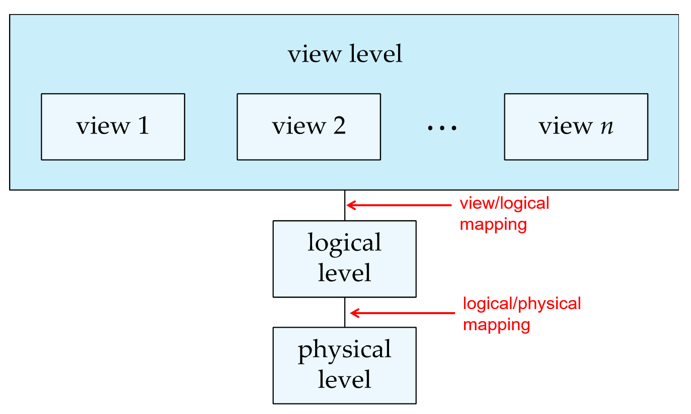
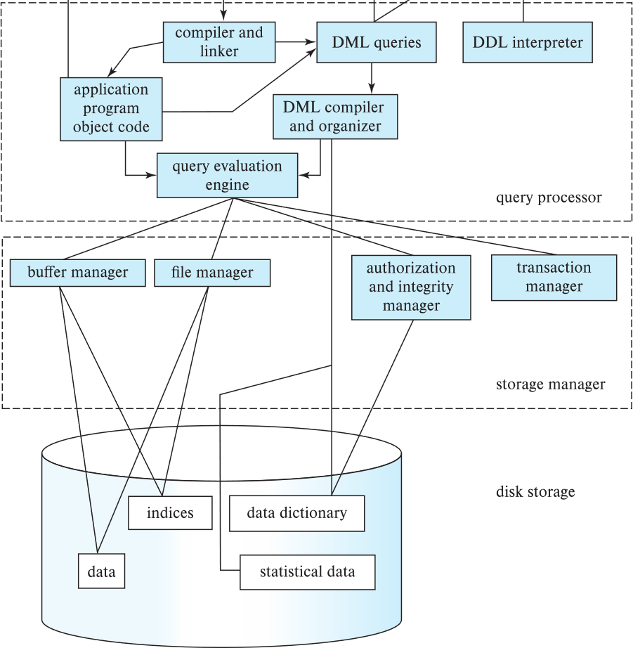
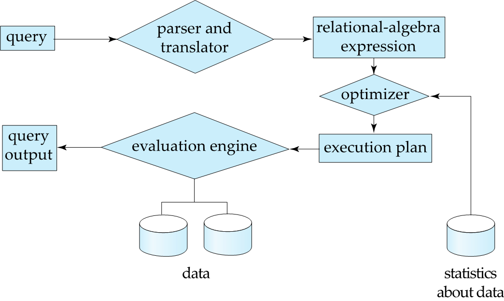

---
tags:
    - Theory
---

# Introduction

## 数据库管理系统

数据库管理系统（Database Management System, DBMS）是一个复杂的软件系统，其任务是管理大型的、复杂的数据集合。其中存储的数据通常具有如下特点：

- 高价值（Highly valuable）
- 数据量相对较大（Relatively large）
- 可被多用户、多应用并发访问

!!! note "直接用文件系统管理数据的问题"
    早期的数据库应用通常直接建立在文件系统之上，通常具有以下几个问题：

    1. 数据冗余与不一致（Data redundancy and inconsistency）：数据被分散存储在多文件中，且格式可能不一致，难以管理
    2. 存取数据困难（Difficulty in accessing data）：必须使用专门的程序才能访问数据
    3. 数据孤立（Data isolation）
    4. 完整性问题（Integrity problems）：程序无法显式声明完整性约束
    5. 更新原子性问题（Atomicity of updates）：简单的文件系统无法保证更新操作的原子性，可能会导致系统故障时数据不一致问题
    6. 并发访问异常（Concurrency exceptions）：多个用户同时访问数据库时，由于指令流顺序不确定，可能导致数据不一致问题
    7. 安全性问题（Security problems）：文件系统没有提供安全机制，容易受到攻击

数据库系统被用于解决这些问题，其主要设计目标如下：

1. 数据持久性（Data persistence）
2. 数据访问便利性（Data access convenience）
3. 数据完整性（Data integrity）
4. 并发控制（Concurrency control）
5. 故障恢复（Failure recovery）
6. 安全控制（Security control）

## 数据库系统的抽象层次

数据库系统的抽象层次（Levels of Abstraction）可分为三层，从低到高依次为：

1. 物理层（Physical Layer）：描述数据在物理介质上是如何存储的
2. 逻辑层（Logical Layer）：描述数据在数据库中是如何组织的，以及数据之间的关系
3. 视图层（View Layer）：数据最终向用户呈现的形式，隐藏了数据存储和维护的细节

数据库系统的核心目的是向用户提供抽象的数据视图（view of data），对用户隐藏数据存储和维护的细节.

## 数据模型

数据模型（Data Model）是用于描述数据结构和关系的概念，其包括了：

- 数据（Data）
- 数据关系（Data relationships）
- 数据语义（Data semantics）
- 数据约束（Data constraints）

!!! note "数据模型的类型"
    - 关系模型（Relational Model）
    - 实体 - 联系模型（Entity-Relationship Model）
    - 半结构化数据模型（Semi-structured Data Model）
    - 基于对象的数据模型（Object-based Data Model）
        - 面向对象（Object-Oriented）
        - 对象 - 关系（Object-Relational）

最常用的数据模型是关系模型，其将所有数据组织成表格形式，每一列代表一个数据属性（Attribute），每一行代表一条数据记录（Record / Tuple / Relation）.

## 数据库语言

数据库语言可分为两类：数据定义语言（Data Definition Language, DDL）和数据操纵语言（Data Manipulation Language, DML）.

=== "数据定义语言"

    数据定义语言用于定义数据库对象，如数据库、表、视图、索引等. 其编译器会生成存储在数据字典（Data Dictionary）中的表模板.

    数据字典中存储的数据被称为元数据（Metadata），包含了：

    - 模式（Schema）：数据库对象（如表、视图、索引等）的定义
    - 完整性约束（Integrity Constraints）：数据库对象之间的约束关系，如主键（Primary Key）、外键（Foreign Key）等
    - 授权（Authorization）：用户对数据库对象的访问权限

=== "数据操纵语言"

    数据操纵语言用于操作数据库对象，如插入、删除、更新、查询等，可分为过程式（Procedural）和陈述式（Declarative / Nonprocedural）两类，区别在于过程式数据操纵语言需要用户描述取得数据的过程，而陈述式数据操纵语言只需要用户指定需要的数据.

    具有信息检索功能的部分数据操纵语言被称为查询语言（Query Language）.

    SQL（Structured Query Language）是最常用的数据操纵语言，其输入为一个或多个数据表，输出为一个结果表. SQL 不是一种图灵完备的语言，但其可以被嵌入其他编程语言中，实现更丰富的功能.

## 数据库引擎

数据库引擎（Database Engine）可分为以下几个部分：

### 存储管理模块

存储管理模块（Storage Manager）提供了存储在物理介质上的数据与应用程序之间的接口，需要完成以下任务：

- 与操作系统的文件系统交互，将数据存储在磁盘上
- 提供高效的数据存储、检索、查询接口

存储管理模块使用了以下几种数据结构，作为物理系统实现的一部分：

- 数据文件
- 数据字典（Data Dictionary）：存储元数据
- 索引（Indices）：用于快速检索数据记录，提供了指向数据记录存储位置的指针

### 查询处理模块

- DDL 解释器
- DML 编译器
- 查询执行引擎

### 事物管理模块

事物（Transaction）是指一组实现单一逻辑功能的数据库操作，通常对应一个完整的业务，具有原子性、一致性、隔离性、持久性.

- 原子性（Atomicity）
- 一致性（Consistency）
- 隔离性（Isolation）
- 持久性（Durability）

事物管理器（Transaction Manager）负责维护数据库在故障时的数据一致性.

并发控制管理器（Concurrency-control Manager）用于管理并发访问，确保多个用户同时访问数据库时，数据不会被破坏.

